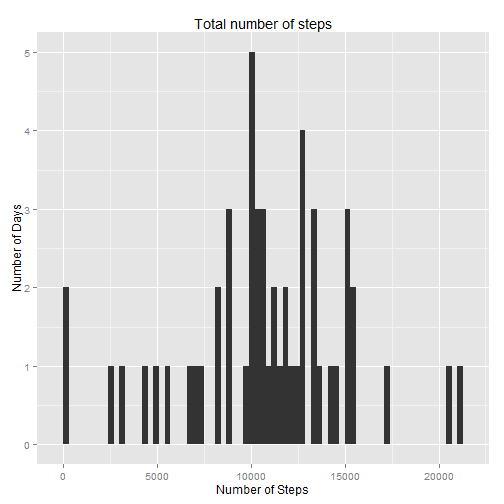
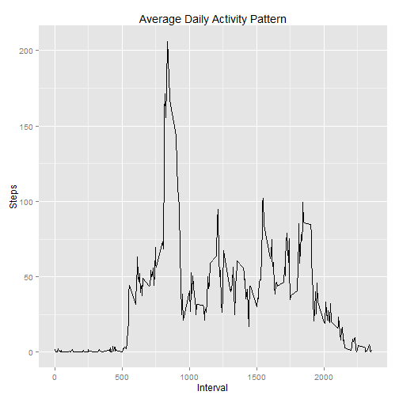
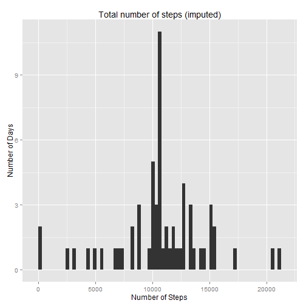
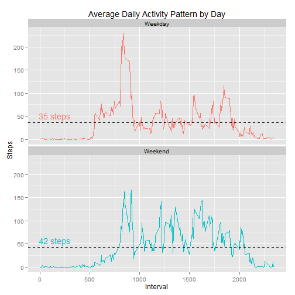

---
output:
  html_document:
    highlight: monochrome
    theme: spacelab
    toc: yes
---

# Reproducible Research: Peer Assessment 1

It is now possible to collect a large amount of data about personal movement using activity monitoring devices such as a Fitbit, Nike Fuelband, or Jawbone Up. These type of devices are part of the “quantified self” movement – a group of enthusiasts who take measurements about thedtDayelves regularly to improve their health, to find patterns in their behavior, or because they are tech geeks. But these data remain under-utilized both because the raw data are hard to obtain and there is a lack of statistical methods and software for processing and interpreting the data.

This assignment makes use of data from a personal activity monitoring device. This device collects data at 5 minute intervals through out the day. The data consists of two months of data from an anonymous individual collected during the months of October and November, 2012 and include the number of steps taken in 5 minute intervals each day.


## Loading and preprocessing the data

The data for this assignment can be downloaded from the [course web site]
(https://d396qusza40orc.cloudfront.net/repdata%2Fdata%2Factivity.zip). 
The variables included in this dataset are:

* steps: Number of steps taking in a 5-minute interval (missing values are coded as NA)
* date: The date on which the measurement was taken in YYYY-MM-DD format
* interval: Identifier for the 5-minute interval in which measurement was taken

The dataset is stored in a comma-separated-value (CSV) file and there are a total
of 17,568 observations in this dataset. 

Load some libraries into the session scope:

```r
library(ggplot2)
```


Settings system locale to ENGLISH 

```r
Sys.setlocale("LC_TIME", "English")
```

```
## [1] "English_United States.1252"
```


The data is loaded into a *data.frame* object via the *read.csv* function:

```r
dt <- read.csv('activity.csv')
```

The *date* variable comes as a character type. For the sake of correctness it
should be converted to the proper date type:


```r
dt$date = as.Date(dt$date, format="%Y-%m-%d")
```

## What is mean total number of steps taken per day?

For this part of the assignment, the missing values in the dataset can be ignored.

### Histogram

Make a histogram of the total number of steps taken each day:


```r
# Filter NA values
dtNonNA <- dt[!is.na(dt$steps), ]

# Summarize steps for each day
dtStepsPerDay <- aggregate(steps ~ date, data= dtNonNA, sum)

# Plot histogram
qplot(steps, data=dtStepsPerDay, binwidth = 300)+
  labs(title="Total number of steps", x="Number of Steps", y="Number of Days")
```

 

Calculate and report the mean and median total number of steps taken per day.

### The mean values per day: 


```r
# Simply calculate the mean 
meanSteps <- mean(dtStepsPerDay$steps)
```

The users made 1.0766 &times; 10<sup>4</sup> steps each day in average.


### The median values per day: 


```r
# Simply calculate the median 
medianSteps <- median(dtStepsPerDay$steps)
```


The users made 10765 steps each day in average.


## What is the average daily activity pattern?


```r
dtActivity <- dtNonNA[, c("steps", "interval")]
dtActivity <- aggregate(steps ~ interval, data= dtActivity, mean)

# Plot histogram
qplot(interval, steps, data=dtActivity, geom= "line")+
  labs(title="Average Daily Activity Pattern", x="Interval", y="Steps")
```

 

The 5-minute interval with the maximum numbers of steps is at interval 835.


## Imputing missing values


There are 2304 records with missing values in the dataset.

The following strategy will be used to impute the missing values: simply use the
median steps for each interval.


```r
impute <- function(int) {
  
  a <- dtActivity$steps[dtActivity$interval == int]
  
  if(length(a) == 0) { return (0) }
  else { return (as.integer(a)) }
}

dt$steps[is.na(dt$steps)]  <- sapply(dt$interval[is.na(dt$steps)], impute) 
```

The new histogram of the total number of steps taken each day:


```r
# Summarize steps for each day
dtStepsPerDayImputed <- aggregate(steps ~ date, data= dt, sum)

# Plot histogram
qplot(steps, data=dtStepsPerDayImputed, binwidth = 300)+
  labs(title="Total number of steps (imputed)", x="Number of Steps", y="Number of Days")
```

 

### The mean values per day (imputed values): 


```r
# Simply calculate the mean 
meanStepsImputed <- mean(dtStepsPerDayImputed$steps)
```

The users made 1.075 &times; 10<sup>4</sup> steps each day in average after imputing missing values.

### The median values per day (imputed values): 


```r
# Simply calculate the median 
medianStepsImputed <- median(dtStepsPerDayImputed$steps)
```


The users made 10641 steps each day in average after imputing missing values.


### Differences

Using the imputed values has an impact: 

* The mean number of steps decreased from
10766 to 10749 steps with missing values in the dataset. 
* The mean number of steps decreased from
10765 to 10641 steps with missing values in the dataset. 

More visible as a diagram:


```r
# Prepare data
dtStepsPerDay$type <- as.factor("Original")
dtStepsPerDayImputed$type <- as.factor("Imputed")

dtStepHisto <- rbind(dtStepsPerDay, dtStepsPerDayImputed)

# Plot histogram
ggplot(dtStepHisto, aes(steps, fill = type))+
  theme(legend.title= element_blank())+
  geom_bar(position= "dodge", binwidth= 400)+
  labs(title="Comparision of total number of steps", x="Number of Steps", y="Number of Days")
```

 


## Are there differences in activity patterns between weekdays and weekends?


Yes, there are differences. There is much more activity on the weekend:


```r
# Mapping from day of week to either weekend or sunday
we <- function(d) if(d %in% c("Sunday","Saturday")) { return( "Weekend") } else {return ("Weekday")}

# Add day variable
dt$wd <- as.factor(weekdays(dt$date)) 
dt$we <- as.factor(sapply(dt$wd, we))

# Agggregate steps by interval and weekday
dtDay <- dt[, c("interval", "steps", "we")]
dtDay <- aggregate(dtDay$steps, by=list(dtDay$interval, dtDay$we), mean)
colnames(dtDay) <- c("interval", "we", "steps")

# Caluclate means
dtWeekday <- dtDay[dtDay$we == "Weekday", ]
dtWeekend <- dtDay[dtDay$we == "Weekend", ]

dtWeekdayMean <- mean(dtWeekday$steps)
dtWeekendMean <- mean(dtWeekend$steps)

# Prepare mean values data frame
dtMean <- data.frame(c(dtWeekdayMean, dtWeekendMean), as.factor(c("Weekday", "Weekend")))
colnames(dtMean) <- c("mean", "we")

# Prepare labels data frame
dtLabel <- data.frame(c(150, 150), c(dtWeekdayMean+15, dtWeekendMean+15), 
                      c(sprintf("%d steps", as.integer(dtWeekdayMean)), sprintf("%d steps", as.integer(dtWeekendMean))), 
                      as.factor(c("Weekday", "Weekend")))
colnames(dtLabel) <- c("x", "y", "lab", "we")

# Plot faceted graph
qplot(interval, steps, data=dtDay, geom= "line", color= we)+
  geom_hline(data= dtMean, aes(yintercept= mean), linetype= 2)+
  geom_text(data= dtLabel, aes(x, y, label=lab))+
  theme(legend.position="none")+
  facet_wrap(~ we, nrow=2)+
  labs(title="Average Daily Activity Pattern by Day", x="Interval", y="Steps")
```

 
