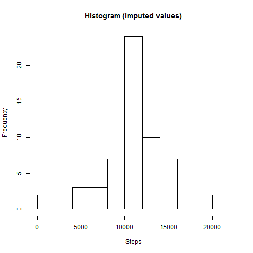
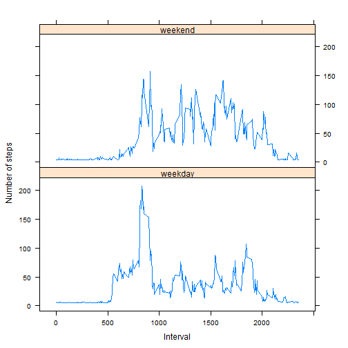

# Reproducible Research: Peer Assessment 1

It is now possible to collect a large amount of data about personal movement using activity monitoring devices such as a Fitbit, Nike Fuelband, or Jawbone Up. These type of devices are part of the “quantified self” movement – a group of enthusiasts who take measurements about themselves regularly to improve their health, to find patterns in their behavior, or because they are tech geeks. But these data remain under-utilized both because the raw data are hard to obtain and there is a lack of statistical methods and software for processing and interpreting the data.

This assignment makes use of data from a personal activity monitoring device. This device collects data at 5 minute intervals through out the day. The data consists of two months of data from an anonymous individual collected during the months of October and November, 2012 and include the number of steps taken in 5 minute intervals each day.


## Loading and preprocessing the data

The data for this assignment can be downloaded from the [course web site]
(https://d396qusza40orc.cloudfront.net/repdata%2Fdata%2Factivity.zip). 
The variables included in this dataset are:

* steps: Number of steps taking in a 5-minute interval (missing values are coded as NA)
* date: The date on which the measurement was taken in YYYY-MM-DD format
* interval: Identifier for the 5-minute interval in which measurement was taken

The dataset is stored in a comma-separated-value (CSV) file and there are a total
of 17,568 observations in this dataset. 

The data is loaded into a *data.frame* object via the *read.csv* function:

```r
library(data.table)
dt <- fread('activity.csv')
```

Settings system locale to ENGLISH 

```r
Sys.setlocale("LC_TIME", "English")
```

```
## [1] "English_United States.1252"
```

## What is mean total number of steps taken per day?

For this part of the assignment, the missing values in the dataset can be ignored.

### Histogram

Make a histogram of the total number of steps taken each day:


```r
dtSteps <- dt[!is.na(dt$steps) & !is.na(dt$date), ]


dtAggregate <- aggregate(steps ~ date, data= dtSteps, sum)

hist(dtAggregate$steps, breaks=15, main= "Histogram", xlab= "Steps")
```

 

Calculate and report the mean and median total number of steps taken per day.

### The mean values per day: 


```r
library(xtable)

meanSteps <- dtSteps[, lapply(.SD, mean), by = c("date")]
meanSteps <- meanSteps[, c("interval"):=NULL]
setnames(meanSteps, c("Date", "Mean number of steps"))

xt <- xtable(meanSteps)
print(xt, type='html')
```

<!-- html table generated in R 3.0.3 by xtable 1.7-3 package -->
<!-- Sun Jun 15 14:57:09 2014 -->
<TABLE border=1>
<TR> <TH>  </TH> <TH> Date </TH> <TH> Mean number of steps </TH>  </TR>
  <TR> <TD align="right"> 1 </TD> <TD> 2012-10-02 </TD> <TD align="right"> 0.44 </TD> </TR>
  <TR> <TD align="right"> 2 </TD> <TD> 2012-10-03 </TD> <TD align="right"> 39.42 </TD> </TR>
  <TR> <TD align="right"> 3 </TD> <TD> 2012-10-04 </TD> <TD align="right"> 42.07 </TD> </TR>
  <TR> <TD align="right"> 4 </TD> <TD> 2012-10-05 </TD> <TD align="right"> 46.16 </TD> </TR>
  <TR> <TD align="right"> 5 </TD> <TD> 2012-10-06 </TD> <TD align="right"> 53.54 </TD> </TR>
  <TR> <TD align="right"> 6 </TD> <TD> 2012-10-07 </TD> <TD align="right"> 38.25 </TD> </TR>
  <TR> <TD align="right"> 7 </TD> <TD> 2012-10-09 </TD> <TD align="right"> 44.48 </TD> </TR>
  <TR> <TD align="right"> 8 </TD> <TD> 2012-10-10 </TD> <TD align="right"> 34.38 </TD> </TR>
  <TR> <TD align="right"> 9 </TD> <TD> 2012-10-11 </TD> <TD align="right"> 35.78 </TD> </TR>
  <TR> <TD align="right"> 10 </TD> <TD> 2012-10-12 </TD> <TD align="right"> 60.35 </TD> </TR>
  <TR> <TD align="right"> 11 </TD> <TD> 2012-10-13 </TD> <TD align="right"> 43.15 </TD> </TR>
  <TR> <TD align="right"> 12 </TD> <TD> 2012-10-14 </TD> <TD align="right"> 52.42 </TD> </TR>
  <TR> <TD align="right"> 13 </TD> <TD> 2012-10-15 </TD> <TD align="right"> 35.20 </TD> </TR>
  <TR> <TD align="right"> 14 </TD> <TD> 2012-10-16 </TD> <TD align="right"> 52.38 </TD> </TR>
  <TR> <TD align="right"> 15 </TD> <TD> 2012-10-17 </TD> <TD align="right"> 46.71 </TD> </TR>
  <TR> <TD align="right"> 16 </TD> <TD> 2012-10-18 </TD> <TD align="right"> 34.92 </TD> </TR>
  <TR> <TD align="right"> 17 </TD> <TD> 2012-10-19 </TD> <TD align="right"> 41.07 </TD> </TR>
  <TR> <TD align="right"> 18 </TD> <TD> 2012-10-20 </TD> <TD align="right"> 36.09 </TD> </TR>
  <TR> <TD align="right"> 19 </TD> <TD> 2012-10-21 </TD> <TD align="right"> 30.63 </TD> </TR>
  <TR> <TD align="right"> 20 </TD> <TD> 2012-10-22 </TD> <TD align="right"> 46.74 </TD> </TR>
  <TR> <TD align="right"> 21 </TD> <TD> 2012-10-23 </TD> <TD align="right"> 30.97 </TD> </TR>
  <TR> <TD align="right"> 22 </TD> <TD> 2012-10-24 </TD> <TD align="right"> 29.01 </TD> </TR>
  <TR> <TD align="right"> 23 </TD> <TD> 2012-10-25 </TD> <TD align="right"> 8.65 </TD> </TR>
  <TR> <TD align="right"> 24 </TD> <TD> 2012-10-26 </TD> <TD align="right"> 23.53 </TD> </TR>
  <TR> <TD align="right"> 25 </TD> <TD> 2012-10-27 </TD> <TD align="right"> 35.14 </TD> </TR>
  <TR> <TD align="right"> 26 </TD> <TD> 2012-10-28 </TD> <TD align="right"> 39.78 </TD> </TR>
  <TR> <TD align="right"> 27 </TD> <TD> 2012-10-29 </TD> <TD align="right"> 17.42 </TD> </TR>
  <TR> <TD align="right"> 28 </TD> <TD> 2012-10-30 </TD> <TD align="right"> 34.09 </TD> </TR>
  <TR> <TD align="right"> 29 </TD> <TD> 2012-10-31 </TD> <TD align="right"> 53.52 </TD> </TR>
  <TR> <TD align="right"> 30 </TD> <TD> 2012-11-02 </TD> <TD align="right"> 36.81 </TD> </TR>
  <TR> <TD align="right"> 31 </TD> <TD> 2012-11-03 </TD> <TD align="right"> 36.70 </TD> </TR>
  <TR> <TD align="right"> 32 </TD> <TD> 2012-11-05 </TD> <TD align="right"> 36.25 </TD> </TR>
  <TR> <TD align="right"> 33 </TD> <TD> 2012-11-06 </TD> <TD align="right"> 28.94 </TD> </TR>
  <TR> <TD align="right"> 34 </TD> <TD> 2012-11-07 </TD> <TD align="right"> 44.73 </TD> </TR>
  <TR> <TD align="right"> 35 </TD> <TD> 2012-11-08 </TD> <TD align="right"> 11.18 </TD> </TR>
  <TR> <TD align="right"> 36 </TD> <TD> 2012-11-11 </TD> <TD align="right"> 43.78 </TD> </TR>
  <TR> <TD align="right"> 37 </TD> <TD> 2012-11-12 </TD> <TD align="right"> 37.38 </TD> </TR>
  <TR> <TD align="right"> 38 </TD> <TD> 2012-11-13 </TD> <TD align="right"> 25.47 </TD> </TR>
  <TR> <TD align="right"> 39 </TD> <TD> 2012-11-15 </TD> <TD align="right"> 0.14 </TD> </TR>
  <TR> <TD align="right"> 40 </TD> <TD> 2012-11-16 </TD> <TD align="right"> 18.89 </TD> </TR>
  <TR> <TD align="right"> 41 </TD> <TD> 2012-11-17 </TD> <TD align="right"> 49.79 </TD> </TR>
  <TR> <TD align="right"> 42 </TD> <TD> 2012-11-18 </TD> <TD align="right"> 52.47 </TD> </TR>
  <TR> <TD align="right"> 43 </TD> <TD> 2012-11-19 </TD> <TD align="right"> 30.70 </TD> </TR>
  <TR> <TD align="right"> 44 </TD> <TD> 2012-11-20 </TD> <TD align="right"> 15.53 </TD> </TR>
  <TR> <TD align="right"> 45 </TD> <TD> 2012-11-21 </TD> <TD align="right"> 44.40 </TD> </TR>
  <TR> <TD align="right"> 46 </TD> <TD> 2012-11-22 </TD> <TD align="right"> 70.93 </TD> </TR>
  <TR> <TD align="right"> 47 </TD> <TD> 2012-11-23 </TD> <TD align="right"> 73.59 </TD> </TR>
  <TR> <TD align="right"> 48 </TD> <TD> 2012-11-24 </TD> <TD align="right"> 50.27 </TD> </TR>
  <TR> <TD align="right"> 49 </TD> <TD> 2012-11-25 </TD> <TD align="right"> 41.09 </TD> </TR>
  <TR> <TD align="right"> 50 </TD> <TD> 2012-11-26 </TD> <TD align="right"> 38.76 </TD> </TR>
  <TR> <TD align="right"> 51 </TD> <TD> 2012-11-27 </TD> <TD align="right"> 47.38 </TD> </TR>
  <TR> <TD align="right"> 52 </TD> <TD> 2012-11-28 </TD> <TD align="right"> 35.36 </TD> </TR>
  <TR> <TD align="right"> 53 </TD> <TD> 2012-11-29 </TD> <TD align="right"> 24.47 </TD> </TR>
   </TABLE>

### The median values per day: 


```r
medianSteps <- dtSteps[, lapply(.SD, median), by = c("date")]
medianSteps <- medianSteps[, c("interval"):=NULL]
setnames(medianSteps, c("Date", "Median number of steps"))
xt <- xtable(medianSteps)
print(xt, type='html')
```

<!-- html table generated in R 3.0.3 by xtable 1.7-3 package -->
<!-- Sun Jun 15 14:57:09 2014 -->
<TABLE border=1>
<TR> <TH>  </TH> <TH> Date </TH> <TH> Median number of steps </TH>  </TR>
  <TR> <TD align="right"> 1 </TD> <TD> 2012-10-02 </TD> <TD align="right"> 0.00 </TD> </TR>
  <TR> <TD align="right"> 2 </TD> <TD> 2012-10-03 </TD> <TD align="right"> 0.00 </TD> </TR>
  <TR> <TD align="right"> 3 </TD> <TD> 2012-10-04 </TD> <TD align="right"> 0.00 </TD> </TR>
  <TR> <TD align="right"> 4 </TD> <TD> 2012-10-05 </TD> <TD align="right"> 0.00 </TD> </TR>
  <TR> <TD align="right"> 5 </TD> <TD> 2012-10-06 </TD> <TD align="right"> 0.00 </TD> </TR>
  <TR> <TD align="right"> 6 </TD> <TD> 2012-10-07 </TD> <TD align="right"> 0.00 </TD> </TR>
  <TR> <TD align="right"> 7 </TD> <TD> 2012-10-09 </TD> <TD align="right"> 0.00 </TD> </TR>
  <TR> <TD align="right"> 8 </TD> <TD> 2012-10-10 </TD> <TD align="right"> 0.00 </TD> </TR>
  <TR> <TD align="right"> 9 </TD> <TD> 2012-10-11 </TD> <TD align="right"> 0.00 </TD> </TR>
  <TR> <TD align="right"> 10 </TD> <TD> 2012-10-12 </TD> <TD align="right"> 0.00 </TD> </TR>
  <TR> <TD align="right"> 11 </TD> <TD> 2012-10-13 </TD> <TD align="right"> 0.00 </TD> </TR>
  <TR> <TD align="right"> 12 </TD> <TD> 2012-10-14 </TD> <TD align="right"> 0.00 </TD> </TR>
  <TR> <TD align="right"> 13 </TD> <TD> 2012-10-15 </TD> <TD align="right"> 0.00 </TD> </TR>
  <TR> <TD align="right"> 14 </TD> <TD> 2012-10-16 </TD> <TD align="right"> 0.00 </TD> </TR>
  <TR> <TD align="right"> 15 </TD> <TD> 2012-10-17 </TD> <TD align="right"> 0.00 </TD> </TR>
  <TR> <TD align="right"> 16 </TD> <TD> 2012-10-18 </TD> <TD align="right"> 0.00 </TD> </TR>
  <TR> <TD align="right"> 17 </TD> <TD> 2012-10-19 </TD> <TD align="right"> 0.00 </TD> </TR>
  <TR> <TD align="right"> 18 </TD> <TD> 2012-10-20 </TD> <TD align="right"> 0.00 </TD> </TR>
  <TR> <TD align="right"> 19 </TD> <TD> 2012-10-21 </TD> <TD align="right"> 0.00 </TD> </TR>
  <TR> <TD align="right"> 20 </TD> <TD> 2012-10-22 </TD> <TD align="right"> 0.00 </TD> </TR>
  <TR> <TD align="right"> 21 </TD> <TD> 2012-10-23 </TD> <TD align="right"> 0.00 </TD> </TR>
  <TR> <TD align="right"> 22 </TD> <TD> 2012-10-24 </TD> <TD align="right"> 0.00 </TD> </TR>
  <TR> <TD align="right"> 23 </TD> <TD> 2012-10-25 </TD> <TD align="right"> 0.00 </TD> </TR>
  <TR> <TD align="right"> 24 </TD> <TD> 2012-10-26 </TD> <TD align="right"> 0.00 </TD> </TR>
  <TR> <TD align="right"> 25 </TD> <TD> 2012-10-27 </TD> <TD align="right"> 0.00 </TD> </TR>
  <TR> <TD align="right"> 26 </TD> <TD> 2012-10-28 </TD> <TD align="right"> 0.00 </TD> </TR>
  <TR> <TD align="right"> 27 </TD> <TD> 2012-10-29 </TD> <TD align="right"> 0.00 </TD> </TR>
  <TR> <TD align="right"> 28 </TD> <TD> 2012-10-30 </TD> <TD align="right"> 0.00 </TD> </TR>
  <TR> <TD align="right"> 29 </TD> <TD> 2012-10-31 </TD> <TD align="right"> 0.00 </TD> </TR>
  <TR> <TD align="right"> 30 </TD> <TD> 2012-11-02 </TD> <TD align="right"> 0.00 </TD> </TR>
  <TR> <TD align="right"> 31 </TD> <TD> 2012-11-03 </TD> <TD align="right"> 0.00 </TD> </TR>
  <TR> <TD align="right"> 32 </TD> <TD> 2012-11-05 </TD> <TD align="right"> 0.00 </TD> </TR>
  <TR> <TD align="right"> 33 </TD> <TD> 2012-11-06 </TD> <TD align="right"> 0.00 </TD> </TR>
  <TR> <TD align="right"> 34 </TD> <TD> 2012-11-07 </TD> <TD align="right"> 0.00 </TD> </TR>
  <TR> <TD align="right"> 35 </TD> <TD> 2012-11-08 </TD> <TD align="right"> 0.00 </TD> </TR>
  <TR> <TD align="right"> 36 </TD> <TD> 2012-11-11 </TD> <TD align="right"> 0.00 </TD> </TR>
  <TR> <TD align="right"> 37 </TD> <TD> 2012-11-12 </TD> <TD align="right"> 0.00 </TD> </TR>
  <TR> <TD align="right"> 38 </TD> <TD> 2012-11-13 </TD> <TD align="right"> 0.00 </TD> </TR>
  <TR> <TD align="right"> 39 </TD> <TD> 2012-11-15 </TD> <TD align="right"> 0.00 </TD> </TR>
  <TR> <TD align="right"> 40 </TD> <TD> 2012-11-16 </TD> <TD align="right"> 0.00 </TD> </TR>
  <TR> <TD align="right"> 41 </TD> <TD> 2012-11-17 </TD> <TD align="right"> 0.00 </TD> </TR>
  <TR> <TD align="right"> 42 </TD> <TD> 2012-11-18 </TD> <TD align="right"> 0.00 </TD> </TR>
  <TR> <TD align="right"> 43 </TD> <TD> 2012-11-19 </TD> <TD align="right"> 0.00 </TD> </TR>
  <TR> <TD align="right"> 44 </TD> <TD> 2012-11-20 </TD> <TD align="right"> 0.00 </TD> </TR>
  <TR> <TD align="right"> 45 </TD> <TD> 2012-11-21 </TD> <TD align="right"> 0.00 </TD> </TR>
  <TR> <TD align="right"> 46 </TD> <TD> 2012-11-22 </TD> <TD align="right"> 0.00 </TD> </TR>
  <TR> <TD align="right"> 47 </TD> <TD> 2012-11-23 </TD> <TD align="right"> 0.00 </TD> </TR>
  <TR> <TD align="right"> 48 </TD> <TD> 2012-11-24 </TD> <TD align="right"> 0.00 </TD> </TR>
  <TR> <TD align="right"> 49 </TD> <TD> 2012-11-25 </TD> <TD align="right"> 0.00 </TD> </TR>
  <TR> <TD align="right"> 50 </TD> <TD> 2012-11-26 </TD> <TD align="right"> 0.00 </TD> </TR>
  <TR> <TD align="right"> 51 </TD> <TD> 2012-11-27 </TD> <TD align="right"> 0.00 </TD> </TR>
  <TR> <TD align="right"> 52 </TD> <TD> 2012-11-28 </TD> <TD align="right"> 0.00 </TD> </TR>
  <TR> <TD align="right"> 53 </TD> <TD> 2012-11-29 </TD> <TD align="right"> 0.00 </TD> </TR>
   </TABLE>


## What is the average daily activity pattern?


```r
library(lattice)

dtActivity <- dtSteps
dtActivity <- dtActivity[, c("date"):=NULL]

dtActivity <- dtActivity[, lapply(.SD, mean), by = c("interval")]

xyplot(dtActivity$steps ~ dtActivity$interval, type='l', xlab='Interval', ylab='Number of steps')
```

 

The 5-minute interval with the maximum numbers of steps is at interval 1705.


## Imputing missing values


```r
dtMissing <- dt[is.na(dt$steps) | is.na(dt$date) | is.na(dt$interval), ]
```

There are 2304 records with missing values in the dataset.

The following strategy will be used to impute the missing values: simply use the
mean steps over all records in the dataset:


```r
m <- mean(dtSteps$steps)
dtNonMissing <- dt
dtNonMissing[is.na(dtNonMissing$steps) | is.na(dtNonMissing$date), c("steps")] <- as.integer(m)
```

The new histogram of the total number of steps taken each day:


```r
dtNonMissingAggregate <- aggregate(steps ~ date, data= dtNonMissing, sum)

hist(dtNonMissingAggregate$steps, breaks=15, main= "Histogram (imputed values)", xlab= "Steps")
```

 

### The mean values per day  (imputed values): 


```r
library(xtable)

meanStepsImputed <- dtNonMissing[, lapply(.SD, mean), by = c("date")]
meanStepsImputed <- meanStepsImputed[, c("interval"):=NULL]
setnames(meanStepsImputed, c("Date", "Mean number of steps"))

xt <- xtable(meanStepsImputed)
print(xt, type='html')
```

<!-- html table generated in R 3.0.3 by xtable 1.7-3 package -->
<!-- Sun Jun 15 14:57:10 2014 -->
<TABLE border=1>
<TR> <TH>  </TH> <TH> Date </TH> <TH> Mean number of steps </TH>  </TR>
  <TR> <TD align="right"> 1 </TD> <TD> 2012-10-01 </TD> <TD align="right"> 37.00 </TD> </TR>
  <TR> <TD align="right"> 2 </TD> <TD> 2012-10-02 </TD> <TD align="right"> 0.44 </TD> </TR>
  <TR> <TD align="right"> 3 </TD> <TD> 2012-10-03 </TD> <TD align="right"> 39.42 </TD> </TR>
  <TR> <TD align="right"> 4 </TD> <TD> 2012-10-04 </TD> <TD align="right"> 42.07 </TD> </TR>
  <TR> <TD align="right"> 5 </TD> <TD> 2012-10-05 </TD> <TD align="right"> 46.16 </TD> </TR>
  <TR> <TD align="right"> 6 </TD> <TD> 2012-10-06 </TD> <TD align="right"> 53.54 </TD> </TR>
  <TR> <TD align="right"> 7 </TD> <TD> 2012-10-07 </TD> <TD align="right"> 38.25 </TD> </TR>
  <TR> <TD align="right"> 8 </TD> <TD> 2012-10-08 </TD> <TD align="right"> 37.00 </TD> </TR>
  <TR> <TD align="right"> 9 </TD> <TD> 2012-10-09 </TD> <TD align="right"> 44.48 </TD> </TR>
  <TR> <TD align="right"> 10 </TD> <TD> 2012-10-10 </TD> <TD align="right"> 34.38 </TD> </TR>
  <TR> <TD align="right"> 11 </TD> <TD> 2012-10-11 </TD> <TD align="right"> 35.78 </TD> </TR>
  <TR> <TD align="right"> 12 </TD> <TD> 2012-10-12 </TD> <TD align="right"> 60.35 </TD> </TR>
  <TR> <TD align="right"> 13 </TD> <TD> 2012-10-13 </TD> <TD align="right"> 43.15 </TD> </TR>
  <TR> <TD align="right"> 14 </TD> <TD> 2012-10-14 </TD> <TD align="right"> 52.42 </TD> </TR>
  <TR> <TD align="right"> 15 </TD> <TD> 2012-10-15 </TD> <TD align="right"> 35.20 </TD> </TR>
  <TR> <TD align="right"> 16 </TD> <TD> 2012-10-16 </TD> <TD align="right"> 52.38 </TD> </TR>
  <TR> <TD align="right"> 17 </TD> <TD> 2012-10-17 </TD> <TD align="right"> 46.71 </TD> </TR>
  <TR> <TD align="right"> 18 </TD> <TD> 2012-10-18 </TD> <TD align="right"> 34.92 </TD> </TR>
  <TR> <TD align="right"> 19 </TD> <TD> 2012-10-19 </TD> <TD align="right"> 41.07 </TD> </TR>
  <TR> <TD align="right"> 20 </TD> <TD> 2012-10-20 </TD> <TD align="right"> 36.09 </TD> </TR>
  <TR> <TD align="right"> 21 </TD> <TD> 2012-10-21 </TD> <TD align="right"> 30.63 </TD> </TR>
  <TR> <TD align="right"> 22 </TD> <TD> 2012-10-22 </TD> <TD align="right"> 46.74 </TD> </TR>
  <TR> <TD align="right"> 23 </TD> <TD> 2012-10-23 </TD> <TD align="right"> 30.97 </TD> </TR>
  <TR> <TD align="right"> 24 </TD> <TD> 2012-10-24 </TD> <TD align="right"> 29.01 </TD> </TR>
  <TR> <TD align="right"> 25 </TD> <TD> 2012-10-25 </TD> <TD align="right"> 8.65 </TD> </TR>
  <TR> <TD align="right"> 26 </TD> <TD> 2012-10-26 </TD> <TD align="right"> 23.53 </TD> </TR>
  <TR> <TD align="right"> 27 </TD> <TD> 2012-10-27 </TD> <TD align="right"> 35.14 </TD> </TR>
  <TR> <TD align="right"> 28 </TD> <TD> 2012-10-28 </TD> <TD align="right"> 39.78 </TD> </TR>
  <TR> <TD align="right"> 29 </TD> <TD> 2012-10-29 </TD> <TD align="right"> 17.42 </TD> </TR>
  <TR> <TD align="right"> 30 </TD> <TD> 2012-10-30 </TD> <TD align="right"> 34.09 </TD> </TR>
  <TR> <TD align="right"> 31 </TD> <TD> 2012-10-31 </TD> <TD align="right"> 53.52 </TD> </TR>
  <TR> <TD align="right"> 32 </TD> <TD> 2012-11-01 </TD> <TD align="right"> 37.00 </TD> </TR>
  <TR> <TD align="right"> 33 </TD> <TD> 2012-11-02 </TD> <TD align="right"> 36.81 </TD> </TR>
  <TR> <TD align="right"> 34 </TD> <TD> 2012-11-03 </TD> <TD align="right"> 36.70 </TD> </TR>
  <TR> <TD align="right"> 35 </TD> <TD> 2012-11-04 </TD> <TD align="right"> 37.00 </TD> </TR>
  <TR> <TD align="right"> 36 </TD> <TD> 2012-11-05 </TD> <TD align="right"> 36.25 </TD> </TR>
  <TR> <TD align="right"> 37 </TD> <TD> 2012-11-06 </TD> <TD align="right"> 28.94 </TD> </TR>
  <TR> <TD align="right"> 38 </TD> <TD> 2012-11-07 </TD> <TD align="right"> 44.73 </TD> </TR>
  <TR> <TD align="right"> 39 </TD> <TD> 2012-11-08 </TD> <TD align="right"> 11.18 </TD> </TR>
  <TR> <TD align="right"> 40 </TD> <TD> 2012-11-09 </TD> <TD align="right"> 37.00 </TD> </TR>
  <TR> <TD align="right"> 41 </TD> <TD> 2012-11-10 </TD> <TD align="right"> 37.00 </TD> </TR>
  <TR> <TD align="right"> 42 </TD> <TD> 2012-11-11 </TD> <TD align="right"> 43.78 </TD> </TR>
  <TR> <TD align="right"> 43 </TD> <TD> 2012-11-12 </TD> <TD align="right"> 37.38 </TD> </TR>
  <TR> <TD align="right"> 44 </TD> <TD> 2012-11-13 </TD> <TD align="right"> 25.47 </TD> </TR>
  <TR> <TD align="right"> 45 </TD> <TD> 2012-11-14 </TD> <TD align="right"> 37.00 </TD> </TR>
  <TR> <TD align="right"> 46 </TD> <TD> 2012-11-15 </TD> <TD align="right"> 0.14 </TD> </TR>
  <TR> <TD align="right"> 47 </TD> <TD> 2012-11-16 </TD> <TD align="right"> 18.89 </TD> </TR>
  <TR> <TD align="right"> 48 </TD> <TD> 2012-11-17 </TD> <TD align="right"> 49.79 </TD> </TR>
  <TR> <TD align="right"> 49 </TD> <TD> 2012-11-18 </TD> <TD align="right"> 52.47 </TD> </TR>
  <TR> <TD align="right"> 50 </TD> <TD> 2012-11-19 </TD> <TD align="right"> 30.70 </TD> </TR>
  <TR> <TD align="right"> 51 </TD> <TD> 2012-11-20 </TD> <TD align="right"> 15.53 </TD> </TR>
  <TR> <TD align="right"> 52 </TD> <TD> 2012-11-21 </TD> <TD align="right"> 44.40 </TD> </TR>
  <TR> <TD align="right"> 53 </TD> <TD> 2012-11-22 </TD> <TD align="right"> 70.93 </TD> </TR>
  <TR> <TD align="right"> 54 </TD> <TD> 2012-11-23 </TD> <TD align="right"> 73.59 </TD> </TR>
  <TR> <TD align="right"> 55 </TD> <TD> 2012-11-24 </TD> <TD align="right"> 50.27 </TD> </TR>
  <TR> <TD align="right"> 56 </TD> <TD> 2012-11-25 </TD> <TD align="right"> 41.09 </TD> </TR>
  <TR> <TD align="right"> 57 </TD> <TD> 2012-11-26 </TD> <TD align="right"> 38.76 </TD> </TR>
  <TR> <TD align="right"> 58 </TD> <TD> 2012-11-27 </TD> <TD align="right"> 47.38 </TD> </TR>
  <TR> <TD align="right"> 59 </TD> <TD> 2012-11-28 </TD> <TD align="right"> 35.36 </TD> </TR>
  <TR> <TD align="right"> 60 </TD> <TD> 2012-11-29 </TD> <TD align="right"> 24.47 </TD> </TR>
  <TR> <TD align="right"> 61 </TD> <TD> 2012-11-30 </TD> <TD align="right"> 37.00 </TD> </TR>
   </TABLE>

### The median values per day (imputed values): 


```r
medianStepsImputed <- dtNonMissing[, lapply(.SD, median), by = c("date")]
medianStepsImputed <- medianStepsImputed[, c("interval"):=NULL]
setnames(medianStepsImputed, c("Date", "Median number of steps"))

xt <- xtable(medianStepsImputed)
print(xt, type='html')
```

<!-- html table generated in R 3.0.3 by xtable 1.7-3 package -->
<!-- Sun Jun 15 14:57:10 2014 -->
<TABLE border=1>
<TR> <TH>  </TH> <TH> Date </TH> <TH> Median number of steps </TH>  </TR>
  <TR> <TD align="right"> 1 </TD> <TD> 2012-10-01 </TD> <TD align="right"> 37.00 </TD> </TR>
  <TR> <TD align="right"> 2 </TD> <TD> 2012-10-02 </TD> <TD align="right"> 0.00 </TD> </TR>
  <TR> <TD align="right"> 3 </TD> <TD> 2012-10-03 </TD> <TD align="right"> 0.00 </TD> </TR>
  <TR> <TD align="right"> 4 </TD> <TD> 2012-10-04 </TD> <TD align="right"> 0.00 </TD> </TR>
  <TR> <TD align="right"> 5 </TD> <TD> 2012-10-05 </TD> <TD align="right"> 0.00 </TD> </TR>
  <TR> <TD align="right"> 6 </TD> <TD> 2012-10-06 </TD> <TD align="right"> 0.00 </TD> </TR>
  <TR> <TD align="right"> 7 </TD> <TD> 2012-10-07 </TD> <TD align="right"> 0.00 </TD> </TR>
  <TR> <TD align="right"> 8 </TD> <TD> 2012-10-08 </TD> <TD align="right"> 37.00 </TD> </TR>
  <TR> <TD align="right"> 9 </TD> <TD> 2012-10-09 </TD> <TD align="right"> 0.00 </TD> </TR>
  <TR> <TD align="right"> 10 </TD> <TD> 2012-10-10 </TD> <TD align="right"> 0.00 </TD> </TR>
  <TR> <TD align="right"> 11 </TD> <TD> 2012-10-11 </TD> <TD align="right"> 0.00 </TD> </TR>
  <TR> <TD align="right"> 12 </TD> <TD> 2012-10-12 </TD> <TD align="right"> 0.00 </TD> </TR>
  <TR> <TD align="right"> 13 </TD> <TD> 2012-10-13 </TD> <TD align="right"> 0.00 </TD> </TR>
  <TR> <TD align="right"> 14 </TD> <TD> 2012-10-14 </TD> <TD align="right"> 0.00 </TD> </TR>
  <TR> <TD align="right"> 15 </TD> <TD> 2012-10-15 </TD> <TD align="right"> 0.00 </TD> </TR>
  <TR> <TD align="right"> 16 </TD> <TD> 2012-10-16 </TD> <TD align="right"> 0.00 </TD> </TR>
  <TR> <TD align="right"> 17 </TD> <TD> 2012-10-17 </TD> <TD align="right"> 0.00 </TD> </TR>
  <TR> <TD align="right"> 18 </TD> <TD> 2012-10-18 </TD> <TD align="right"> 0.00 </TD> </TR>
  <TR> <TD align="right"> 19 </TD> <TD> 2012-10-19 </TD> <TD align="right"> 0.00 </TD> </TR>
  <TR> <TD align="right"> 20 </TD> <TD> 2012-10-20 </TD> <TD align="right"> 0.00 </TD> </TR>
  <TR> <TD align="right"> 21 </TD> <TD> 2012-10-21 </TD> <TD align="right"> 0.00 </TD> </TR>
  <TR> <TD align="right"> 22 </TD> <TD> 2012-10-22 </TD> <TD align="right"> 0.00 </TD> </TR>
  <TR> <TD align="right"> 23 </TD> <TD> 2012-10-23 </TD> <TD align="right"> 0.00 </TD> </TR>
  <TR> <TD align="right"> 24 </TD> <TD> 2012-10-24 </TD> <TD align="right"> 0.00 </TD> </TR>
  <TR> <TD align="right"> 25 </TD> <TD> 2012-10-25 </TD> <TD align="right"> 0.00 </TD> </TR>
  <TR> <TD align="right"> 26 </TD> <TD> 2012-10-26 </TD> <TD align="right"> 0.00 </TD> </TR>
  <TR> <TD align="right"> 27 </TD> <TD> 2012-10-27 </TD> <TD align="right"> 0.00 </TD> </TR>
  <TR> <TD align="right"> 28 </TD> <TD> 2012-10-28 </TD> <TD align="right"> 0.00 </TD> </TR>
  <TR> <TD align="right"> 29 </TD> <TD> 2012-10-29 </TD> <TD align="right"> 0.00 </TD> </TR>
  <TR> <TD align="right"> 30 </TD> <TD> 2012-10-30 </TD> <TD align="right"> 0.00 </TD> </TR>
  <TR> <TD align="right"> 31 </TD> <TD> 2012-10-31 </TD> <TD align="right"> 0.00 </TD> </TR>
  <TR> <TD align="right"> 32 </TD> <TD> 2012-11-01 </TD> <TD align="right"> 37.00 </TD> </TR>
  <TR> <TD align="right"> 33 </TD> <TD> 2012-11-02 </TD> <TD align="right"> 0.00 </TD> </TR>
  <TR> <TD align="right"> 34 </TD> <TD> 2012-11-03 </TD> <TD align="right"> 0.00 </TD> </TR>
  <TR> <TD align="right"> 35 </TD> <TD> 2012-11-04 </TD> <TD align="right"> 37.00 </TD> </TR>
  <TR> <TD align="right"> 36 </TD> <TD> 2012-11-05 </TD> <TD align="right"> 0.00 </TD> </TR>
  <TR> <TD align="right"> 37 </TD> <TD> 2012-11-06 </TD> <TD align="right"> 0.00 </TD> </TR>
  <TR> <TD align="right"> 38 </TD> <TD> 2012-11-07 </TD> <TD align="right"> 0.00 </TD> </TR>
  <TR> <TD align="right"> 39 </TD> <TD> 2012-11-08 </TD> <TD align="right"> 0.00 </TD> </TR>
  <TR> <TD align="right"> 40 </TD> <TD> 2012-11-09 </TD> <TD align="right"> 37.00 </TD> </TR>
  <TR> <TD align="right"> 41 </TD> <TD> 2012-11-10 </TD> <TD align="right"> 37.00 </TD> </TR>
  <TR> <TD align="right"> 42 </TD> <TD> 2012-11-11 </TD> <TD align="right"> 0.00 </TD> </TR>
  <TR> <TD align="right"> 43 </TD> <TD> 2012-11-12 </TD> <TD align="right"> 0.00 </TD> </TR>
  <TR> <TD align="right"> 44 </TD> <TD> 2012-11-13 </TD> <TD align="right"> 0.00 </TD> </TR>
  <TR> <TD align="right"> 45 </TD> <TD> 2012-11-14 </TD> <TD align="right"> 37.00 </TD> </TR>
  <TR> <TD align="right"> 46 </TD> <TD> 2012-11-15 </TD> <TD align="right"> 0.00 </TD> </TR>
  <TR> <TD align="right"> 47 </TD> <TD> 2012-11-16 </TD> <TD align="right"> 0.00 </TD> </TR>
  <TR> <TD align="right"> 48 </TD> <TD> 2012-11-17 </TD> <TD align="right"> 0.00 </TD> </TR>
  <TR> <TD align="right"> 49 </TD> <TD> 2012-11-18 </TD> <TD align="right"> 0.00 </TD> </TR>
  <TR> <TD align="right"> 50 </TD> <TD> 2012-11-19 </TD> <TD align="right"> 0.00 </TD> </TR>
  <TR> <TD align="right"> 51 </TD> <TD> 2012-11-20 </TD> <TD align="right"> 0.00 </TD> </TR>
  <TR> <TD align="right"> 52 </TD> <TD> 2012-11-21 </TD> <TD align="right"> 0.00 </TD> </TR>
  <TR> <TD align="right"> 53 </TD> <TD> 2012-11-22 </TD> <TD align="right"> 0.00 </TD> </TR>
  <TR> <TD align="right"> 54 </TD> <TD> 2012-11-23 </TD> <TD align="right"> 0.00 </TD> </TR>
  <TR> <TD align="right"> 55 </TD> <TD> 2012-11-24 </TD> <TD align="right"> 0.00 </TD> </TR>
  <TR> <TD align="right"> 56 </TD> <TD> 2012-11-25 </TD> <TD align="right"> 0.00 </TD> </TR>
  <TR> <TD align="right"> 57 </TD> <TD> 2012-11-26 </TD> <TD align="right"> 0.00 </TD> </TR>
  <TR> <TD align="right"> 58 </TD> <TD> 2012-11-27 </TD> <TD align="right"> 0.00 </TD> </TR>
  <TR> <TD align="right"> 59 </TD> <TD> 2012-11-28 </TD> <TD align="right"> 0.00 </TD> </TR>
  <TR> <TD align="right"> 60 </TD> <TD> 2012-11-29 </TD> <TD align="right"> 0.00 </TD> </TR>
  <TR> <TD align="right"> 61 </TD> <TD> 2012-11-30 </TD> <TD align="right"> 37.00 </TD> </TR>
   </TABLE>

### Differences

Using the imputed values has an impact: 

* The mean number of steps decreased from
37.3826 to 37.3324 steps with missing values in the dataset. 
* The mean number of steps increased from
0 to 4.8525 steps with missing values in the dataset. 

## Are there differences in activity patterns between weekdays and weekends?


Yes, there are differences. There is much more activity on the weekend:


```r
library(lattice)


we <- function(d) if(d %in% c("Sunday","Saturday")) { return( "weekend") } else {return ("weekday")}

dt <- dtNonMissing[, wd:= as.factor(weekdays(as.Date(dtNonMissing$date, format="%Y-%m-%d"))) ]
dt <- dtNonMissing[, we:= as.factor(sapply(dtNonMissing$wd, we))]
dt <- dt[, c("date", "wd"):=NULL]

ms <- dt[, lapply(.SD, mean), by = c("interval", "we")]

xyplot(ms$steps ~ ms$interval | ms$we, layout= c(1,2), type='l', xlab='Interval', ylab='Number of steps')
```

 
